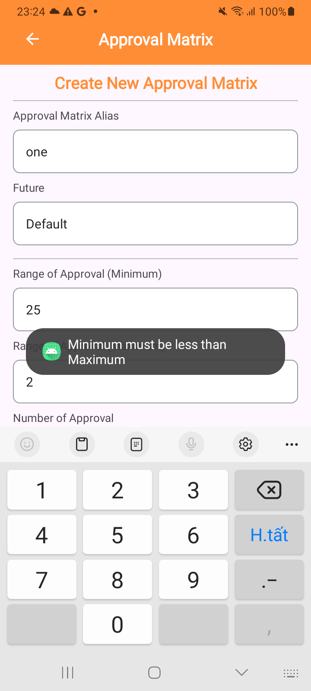

# Approval-Matrix

## ⚡Introduction
This project is an Android Kotlin application for managing approval matrices. It allows users to create, update, delete, and filter approval matrices.

## 📸 Sreenshots
|  |  |   |
| :---:                              | :---:                             | :---:                              |
| When app launch                    | Filter by default                 | Filter by default & Transfer online|
|   |  |   |
| When create Approval Matrix        | Show error when min > max         | When update Approval Matrix        |
|   |  |   |

## ✈️ Features
- Create new approval matrices
- Update existing approval matrices
- Delete approval matrices
- Filter matrices by type (Default, Transfer Online)
- View all matrices in a RecyclerView

## 🪄 Technologies Used
- Kotlin
- Android SDK
- Android Jetpack (ViewBinding, Room, etc.)
- Coroutine for background operations

## ⚙️ Project Structure
- ui/component/main/MainActivity.kt: Main screen displaying the list of approval matrices.
- ui/component/create_matrix/CreateMatrixActivity.kt: Screen for creating and updating approval matrices.
- data/local/ApprovalMatrix.kt: Data class representing an approval matrix.
- helper/database/AppDatabase.kt: Room database setup for storing approval matrices.

## 🛠️ Setup and Installation
### 1. Clone the repository:
To install this project, clone the repository and build it using your preferred Kotlin-compatible build tool.

#### Clone the repository
```bash
git clone https://github.com/thanhdangg/Approval-Matrix.git
cd Approval-Matrix
```
### 2. Open the project in Android Studio:
- Open Android Studio.
- Select "Open an existing Android Studio project".
- Navigate to the cloned repository and select it.

### 3. Build the project
- Click on "Build" in the top menu.
- Select "Make Project" to build the project.
### 4. Run the project
- Connect an Android device or start an emulator.
- Click on the "Run" button in Android Studio.

## 🎗️ Usage
- Creating a Matrix:
  -   Click on the "Tambah New Matrix" button.
  -   Fill in the details and click "Save".
- Updating a Matrix:
  -   Click on a matrix item in the list.
  -   Update the details and click "Update".
- Deleting a Matrix:
  -   Click on a matrix item in the list.
  -   Click the "Delete" button.
- Filtering Matrices:
  -   Use the "Default" and "Transfer" buttons to filter the list of matrices. 

## 🔖 Contributing
I welcome contributions! Please follow these steps to contribute:

### Fork the repository.
1. Fork the repository.
2. Create a new branch (git checkout -b feature-branch).
3. Make your changes.
4. Commit your changes (git commit -m 'Add some feature').
5. Push to the branch (git push origin feature-branch).
6. Open a pull request.

## ⚓ License
This project is licensed under the MIT License - see the [LICENSE](./LICENSE) file for details.

## 📞Contact
For any inquiries or issues, please contact [me](https://github.com/thanhdangg) on GitHub.

